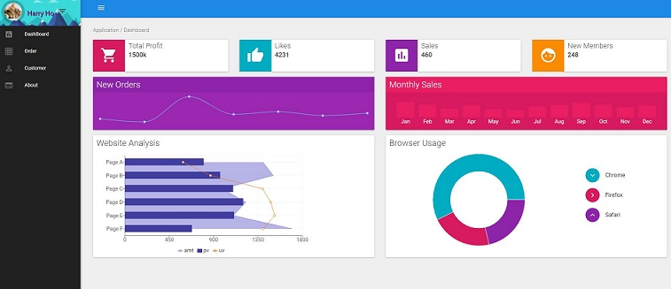
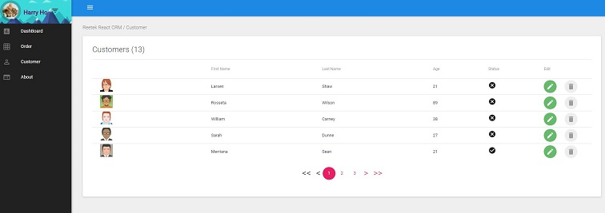

# React Redux CRM

> A reusable CRM project for real-world business based on React 15.4, React-Redux & Material-UI

This is the very first version, feel free to use for any app. Contributions are always welcome!

The goal of this starter project is to create reusable project for real-world business. To achieve this target, we need a solution which should include simple authentication process, restful API with token support and simple but elegant UI design.

### Features

- This project is built on the top of React/Redux.
- The UI part of this project uses Material-UI.
- This project uses Redux-Thunk to support back-end API.
- ~~To simulate real-world business, this starter project chooses Json-Server as fake Restful API. (You can simple replace it with your own API)~~

* Fake API is just readonly fake service.
* CRUD functions for Customer, Order and Product

### Live Demo

[Demo](https://react-app-demo.harryho.org) The demo is just a proof of concept. It doesn't have back-end API and all features of master branch.

### Screenshots







## Build Setup

```bash
# Clone project
git clone https://github.com/harryho/react-crm.git


# install the packages with npm
cd react-crm
npm install

# start the server with hot reload at localhost:4000
npm run start
# or yarn
yarn start
